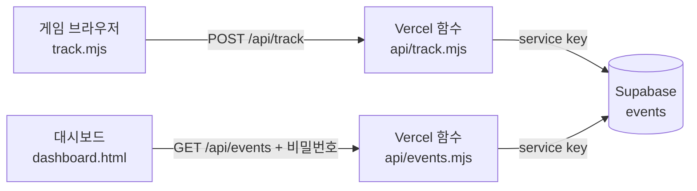

# 프로토타입 데이터 수집·배포 정리

2026-09-22

투자·생활비 선택 게임 프로토타입이 Vercel에 배포됐고, 플레이어의 모든 선택과 설문 응답이 Supabase에 저장되며, 팀은 비밀번호로 잠긴 대시보드에서 표로 보고 CSV로 내려받을 수 있다.

## 링크

| 용도 | 주소 | 누가 |
| --- | --- | --- |
| 게임 (공유용) | https://miracle-of-hanriver.vercel.app/ | 플레이어 |
| 대시보드 | https://miracle-of-hanriver.vercel.app/dashboard.html | 팀 (비밀번호 필요) |
| 코드 | https://github.com/jinnarajin/2026-C6-A8-miracleOfHanRiver | 팀 (private) |
| Vercel 관리 | https://vercel.com/jinnarajins-projects/miracle-of-hanriver | 배포·환경변수 담당 |
| Supabase | Table Editor의 `events` 테이블 | 원본 데이터 확인·삭제 |

대시보드 비밀번호는 Vercel 환경변수 `DASHBOARD_PASSWORD`에 있고, 팀 담당자에게 직접 받는다.

## 무엇이 바뀌었나

게임 규칙과 화면은 그대로다. 기록을 서버로 보내는 코드와 그걸 보는 화면만 덧붙였다. 모두 `프로토타입/` 안에 있다.

| 파일 | 역할 |
| --- | --- |
| `track.mjs` | 방문자·세션 ID를 만들고 `/api/track`으로 이벤트를 보낸다. 실패해도 게임은 멈추지 않는다. |
| `api/track.mjs` | 이벤트를 받아 검사하고 Supabase에 저장하는 Vercel 서버리스 함수 |
| `api/events.mjs` | 비밀번호가 맞을 때만 전체 이벤트를 돌려준다 (최근 5,000건) |
| `api/_supabase.mjs` | Supabase REST 호출 공통 코드 |
| `dashboard.html` | 대시보드. 외부 라이브러리 없이 파일 하나 |
| `supabase.sql` | `events` 테이블 생성 SQL. 이미 실행했다. |
| `dev.mjs` | 로컬 확인용 서버. 환경변수 없으면 메모리 DB를 쓴다. |
| `design/dashboard-design.md` | 대시보드 디자인 규칙 |

기존 코드에서 건드린 곳은 세 파일이다.

- `research.mjs`: 이미 있던 빈 함수 `log`를 실제 전송으로 바꿨다. 1스테이지 선택·설문 이벤트는 여기를 거친다. 설문 제출 시 답변도 함께 보낸다.
- `app.mjs`: 1스테이지 결과 전송, 다시 시작 시 새 세션 ID.
- `stage2.mjs`: 2스테이지 선택·응답·결과 전송.

`engine.mjs`와 `stage2-engine.mjs`(게임 계산 로직)는 손대지 않았다.

## 저장되는 데이터

테이블은 `events` 하나다. 한 줄이 이벤트 하나이고, 세부 내용은 `payload` JSON에 들어간다.

| 컬럼 | 내용 |
| --- | --- |
| `visitor_id` | 브라우저당 하나. localStorage에 보관. 같은 사람이 여러 판을 해도 같은 값 |
| `session_id` | 한 판당 하나. 다시 시작하면 바뀐다 |
| `stage`, `turn` | 1 또는 2, 그때의 턴 번호 |
| `kind` | 이벤트 종류 (아래 표) |
| `payload` | 종류별 세부 내용 |
| `created_at` | 서버 기준 시각 |

| kind | 언제 | payload에 들어가는 것 |
| --- | --- | --- |
| `choice` | 1스테이지 버튼 선택 | `action` (buy, sell, wait, pay, pause 등) |
| `expense_reduce` | 생활비 줄이기 | 항목, 금액, 건강 변화 |
| `answer` | 설문·회고 제출 | `form` 이름, 답변 전체, 동의 기록 |
| `form_open`, `form_complete`, `offer_skipped` | 설문 열기·완료·건너뛰기 | `form` 이름 |
| `reward_granted` | 지원금 지급 | 종류, 금액 |
| `stage1_result` | 1스테이지 종료 | 종료 사유, 현금, 주식, 건강, 손익, 선택 이력 전체 |
| `stage2_choice` | 2스테이지 선택 | `action`, 현금, 건강, 보유 수량 |
| `stage2_answer` | 2스테이지 회고·의견 | `form`, 답변, 동의 기록 |
| `stage2_result` | 2스테이지 종료 | 순자산, 현금, 건강, 선택 이력 전체 |
| `restart` | 다시 시작 | 없음 |

이름, 연락처 같은 식별 정보는 받지 않는다. 설문 응답에는 동의 버전과 시각이 함께 저장된다.

## 구조

브라우저는 Supabase를 직접 모른다. 키는 Vercel 서버에만 있다.

저장은 버튼을 누를 때마다 바로 일어나고, 조회는 대시보드에서 새로고침을 누를 때 일어난다. Supabase 테이블은 RLS가 켜져 있고 정책이 없어서 공개 키로는 읽지도 쓰지도 못한다.

## 운영

**배포.** GitHub `main`에 push하면 Vercel이 1분 안에 자동 배포한다. Root Directory는 `프로토타입`으로 지정되어 있다. 따로 할 일 없다.

**환경변수.** Vercel 프로젝트 Settings → Environment Variables에 세 개가 있다. 값은 코드나 문서에 적지 않는다.

| 이름 | 역할 |
| --- | --- |
| `SUPABASE_URL` | Supabase 프로젝트 주소 |
| `SUPABASE_SERVICE_ROLE_KEY` | Supabase secret 키 (`sb_secret_...`). DB 전체 권한이라 외부에 내지 않는다 |
| `DASHBOARD_PASSWORD` | 대시보드 비밀번호 |

**로컬 실행.** `프로토타입` 폴더에서 `node dev.mjs` → http://127.0.0.1:4174/. 환경변수 없이 띄우면 메모리 DB를 써서 실제 데이터를 건드리지 않고, 대시보드 비밀번호는 `dev`다.

**데이터 확인.** 표로 보려면 대시보드, 원본을 지우거나 SQL로 보려면 Supabase Table Editor. 대시보드의 CSV 내려받기는 현재 필터에 맞는 행만 내려받는다.

**개인정보.** 게임 안 고지문은 수집일로부터 30일 안에 파기한다고 약속한다. 자동 삭제는 아직 안 켜져 있다 (다음 섹션).

## 남은 일과 주의할 점

- [ ] 30일 자동 삭제 켜기: Supabase SQL Editor에서 `supabase.sql` 맨 아래 주석 처리된 pg_cron 한 줄 실행. 수집 시작 전에 켜는 게 맞다.
- [ ] 테스트 데이터 정리: 방문자 `deploy-check` 한 줄은 배포 확인용이다. Table Editor에서 지우면 된다.
- [ ] 실제 수집 전 팀원 한 명이 게임을 끝까지 해 보고 대시보드에 1·2스테이지 결과가 둘 다 찍히는지 확인.

주의할 점 두 가지.

- `tests/engine.test.mjs`에 실패 1건이 있는데 이번 작업 이전부터 있던 것이다. 게임 로직 파일은 손대지 않았다.
- 대시보드는 최근 5,000건만 불러온다. 이벤트가 그보다 많아지면 (한 판에 약 30건이니 150판 정도) 오래된 것은 표에서 빠진다. 그때는 Supabase에서 직접 보거나 한도를 올리면 된다.
